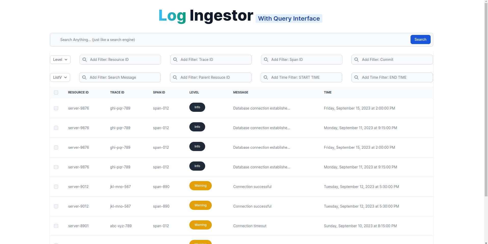
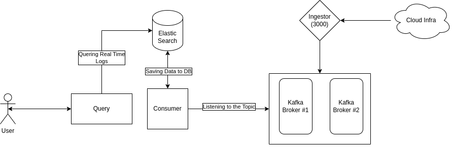

# Log Ingestor and Query Interface

Submission by abhishtchouhan@gmail.com. Same email used while applying on Career Portal

**How to Run**

- First run all the Docker Contianers: `sudo sh start.sh`

- ~~Run Python Query App (Install all dependencies first)
`python3 query/app.py`~~ (Update: Fixed the Issue)

- Go to http://localhost:3002, the UI will be loaded (Read the Operator Guider before Proceeding)
- All logs can be Injected from  ` [POST] http://localhost:3000/logger `
 Read the API References before Proceeding.

 
## **How to Operate**
- There is a file `dummy_dataset_injector.py` which will add dummy dataset for testing. 
 - All major services will take some time and use atlest 8GiB of Memory during Startup. Its a **MicroService Architecture**, so running all standalone services in one machine will eat up some memory.

 - Go to http://localhost:3002, the UI will be loaded
 - There is one main big serach box, where you can search anything, and enjoy the power of Elastic Search
 - There are other search boxes with individual parameters; simply input values into each of them, and the results will dynamically change. This feature empowers you to apply multiple parameters simultaneously.

## Features
|Features| In Service |
|-|--|
|  Multiple Search Capability  | ✅ |
| Volume Logs Handles Capability |✅ |
| Good Looking UI | ✅ |
| RBAC integrated on UI | ❌ | 
| Real/Near Real-Time Logging |  *✅ |
| Multi-Parameters | ✅ |
| Range: Time based | ✅ |
| Range: Date based | ✅ |
| API's Available with Health Checkup | ✅ |
| Message based Quering (raw text) | ✅ 

**Things to know :**

 1. Ignoring RBAC as i'm short on Time. Refer my: [RBAC Repo](https://github.com/imabhisht/edtech-management)

 2. Everything is Dockerize, so you can run it on Distributed System for Fault Tolerence System.

 3. We can add more Indexing and Sharding on Elastic Search for more performance. Also we can add more Kafka Brokers & Partitions for more fault tolerence. But for sake of this assignment, i'm keeping it simple. (Else my System Will 💥)

 3. I didn't add a **calendar** or **time picke**r because my CSS skills are not strong, and the messy CSS was not aesthetically pleasing. Therefore, if you need to query, please enter the **full timestamp** from start to end on both input box respectively. **[Format: "2023-09-10T00:00:00Z" ]**

 4. The Last Query Docker Container was not connecting with Host machine, i dont know why. I will figure that out soon, for meantime run the Query Server using `python3 query/app.py.`

 5. Yea that's it. Not got much time, but tired my best to submit this assignment. Contact me incase any issue on the code. 

 

## System Design

### Components:

1.  **Express Log Ingestor:**
    
    -   An Express server serving as the log ingestor, receiving logs over HTTP on port `3000`.
    -   Ingests log data in JSON format and produces messages to Kafka for further processing.
2.  **Kafka Cluster:**
    
    -   Utilizes a Kafka cluster with two brokers, each managing partitions for scalability.
    -   The Kafka topic serves as an intermediary for log messages between the ingestor and processing components.
3.  **Elasticsearch Database:**
    
    -   Elasticsearch is employed as the backend database for storing and indexing log data efficiently.
    -   Provides powerful full-text search capabilities, making it suitable for querying log information.
4.  **Consumer Service (Node.js/Python):**
    
    -   A dedicated consumer service continuously listens to the Kafka topic for incoming log messages.
    -   Consumes messages and asynchronously adds log data to Elasticsearch for indexing and storage.
    -   Enhances system scalability, allowing independent scaling of the log ingestor and consumer components.

### System Architecture:

-   **Decoupling:**
    
    -   Log ingestor and log processing components are decoupled through Kafka.
    -   Kafka acts as a message broker, facilitating asynchronous communication between components.
-   **Scalability:**
    
    -   Kafka's partitioning allows for horizontal scalability, enabling efficient handling of increasing log volumes.
    -   Independently scalable components: The Express server and Kafka brokers can scale based on the workload.
-   **Durability and Fault Tolerance:**
    
    -   Kafka ensures durability by persisting log messages.
    -   Fault-tolerant architecture: In case of component failures, Kafka retains messages, and the consumer can catch up.
-   **Asynchronous Processing:**
    
    -   Asynchronous log processing enables the log ingestor to continue ingesting logs without waiting for database operations to complete.

### Technical Choices:

-   **Express and Kafka:**
    
    -   Express server handles HTTP log ingestion.
    -   Kafka serves as a scalable and fault-tolerant message broker.
-   **Elasticsearch:**
    
    -   Elasticsearch provides real-time indexing and powerful search capabilities, suitable for efficient log data storage.
-   **Consumer  (Node.js/Python):**
    
    -   Choice of Node.js for the consumer service allows flexibility based on team expertise and preferences.

 

Technology I Used:

- **Python** (For Querying and Searching)
- **NodeJS** (For Handling Concurrency, can be replace with GoLang, but im familer with express more than Go)
 - **Apache Kafka** (Partition=1, Topic Replication Factor=1, **Broker=2**)
 - **Elastic Search** (Also added Full Text Search Capabilities)
 - **Docker** (*Microservices Architecture*, So that we can deploy services on multiple server for fault tolerence)
 - **HTML/JS for UI** *(Still under development, I don't like CSS, but API's are working)*

### Conclusion:

This system design leverages the strengths of Kafka for efficient message queuing, Elasticsearch for powerful full-text search, and a decoupled architecture for scalability and fault tolerance. It aligns with industrial best practices for handling and processing log data in a scalable and resilient manner. The combination of technologies ensures a robust and efficient log processing system suitable for handling vast volumes of log data.

**API's References**

    [GET] http://localhost:3000/health_check 

    [POST] http://localhost:3000/logger
    BODY RAW JSON: 
    {
	"level": "error",
	"message": "Failed to connect to DB",
    "resourceId": "server-1234",
	"timestamp": "2023-09-15T08:00:00Z",
	"traceId": "abc-xyz-123",
    "spanId": "span-456",
    "commit": "5e5342f",
    "metadata": {
        "parentResourceId": "server-0987"
    }}

    [GET] http://localhost:3002/search
    PARMS:
    -> base_search (fix "*" search with 10 rows limit)
    -> q (to search anything,full text search)
    
    -> Multi-Param Search (Add them as parameters; using multiple simultaneously will enable searching with multiple criteria.)
    level
    start_time
    end_time
    trace_id
    span_id
    parent_resource_id
    commit
    resource_id
    message
    

    
